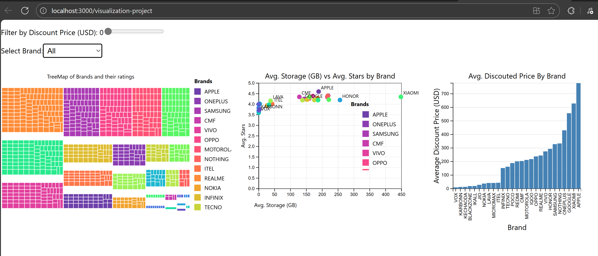

# 📊 Interactive Smartphone Sales Dashboard

**Technologies:** React.js | D3.js | HTML | CSS  
**Live Demo:** [View Dashboard](https://rahulpatelrp30.github.io/visualization-project/)

## 🎯 Overview
Interactive visualization dashboard showcasing smartphone market analysis through dynamic charts and filters.

## 📸 Dashboard Preview
<div align="center">
  

</div>


---

## ✨ Key Features

### 📊 Interactive Visualizations
```
📈 Bar Chart
│     Price Distribution by Brand
│   250K ┤        ▄▄
│   200K ┤     ▄▄ ██
│   150K ┤  ▄▄ ██ ██
│   100K ┤  ██ ██ ██
└────────┴─────────────
         Apple Samsung Others
```

### 🔍 Real-time Analysis
- **Dynamic Filtering:** Instant updates across all charts
- **Price Range Slider:** Filter by price brackets
- **Brand Selection:** Compare specific manufacturers
- **Storage Options:** Analyze capacity vs. price correlation

### 💡 Technical Highlights
- **React.js Components:** Modular, reusable chart components
- **D3.js Integration:** Powerful data visualization capabilities
- **CSV Data Processing:** Clean, efficient data management
- **Responsive Design:** Adapts to all screen sizes
- Responsive one-page layout built with React.js  
- Helps retail managers make **data-driven inventory and pricing decisions**

---

## 🚀 Run Locally
1. Clone the repo  
   ```bash
   git clone https://github.com/rahulpatelrp30/visualization-project.git
   cd visualization-project


